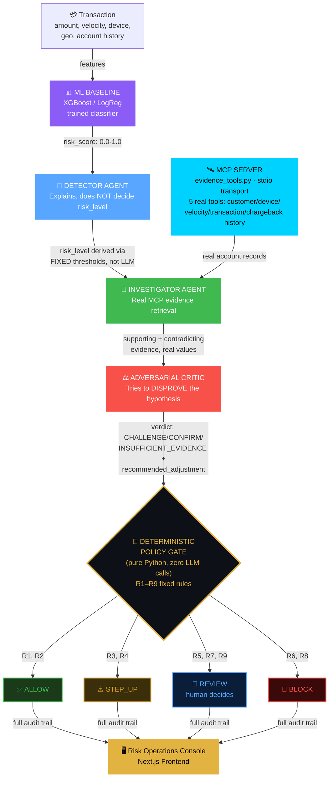
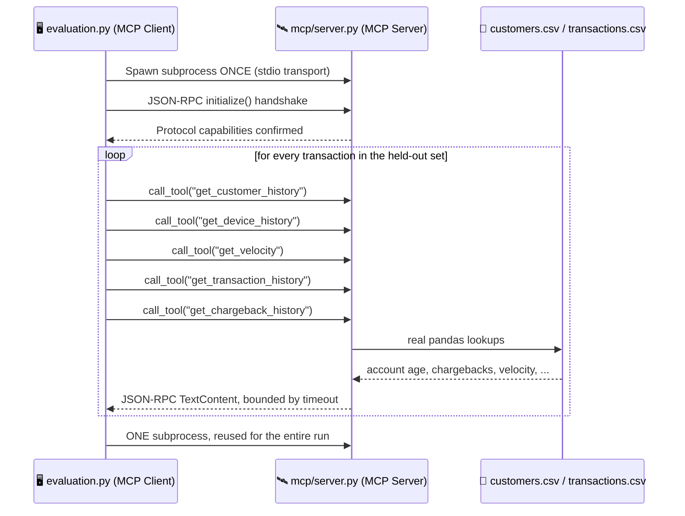

<div align="center">
<h1>AEGIS-SWARM — Razorpay Edition</h1>
    
> **By CODERUDRA-X**
    
### The AI That Has to Earn the Right to Block a Payment.

## One Transaction. Four Independent Minds. Zero LLM Vetoes on the Final Call.

</div>

<p align="center">

</p>

<p align="center">


</p>

> **Most fraud systems optimize for catching fraud. AEGIS-SWARM optimizes for not being wrong in either direction — and can prove it on a held-out test set.**

AEGIS-SWARM — Razorpay Edition is an **evidence-gated AI risk engine** for merchant loss defense. Built for the **AI Risk Manager** track, on the **Payment Fraud / Chargeback Risk** loss class — because blocking a legitimate customer costs real money too, and a fraud model that only optimizes for recall is optimizing for the wrong number.

Every transaction is scored by a trained ML baseline, explained by an LLM Detector, independently investigated against real account/device/velocity history via **actual MCP tool calls**, challenged by an Adversarial Critic that is explicitly rewarded for finding reasons to *disagree* — and only then does a **deterministic, zero-LLM Policy Gate** decide whether the transaction is ALLOWed, STEP-UP verified, sent to human REVIEW, or BLOCKed.

> **AI is not allowed to block a payment until another system has tried to disprove the fraud hypothesis.**

This is a **domain transformation** of a proven 4-agent architecture (previously built for crowd-safety threat detection), not a bolt-on. See [`Lineage`](#-lineage--what-was-reused-vs-rebuilt) for exactly what carried over and what was deleted.

---

## 🌐 Live Demo

| Component | Platform | Link |
|---|---|---|
| **Frontend (Risk Operations Console)** | Vercel | *🚧 * |
| **Backend API (Risk Engine)** | Docker (Render / HF Spaces / Railway) | *🚧 * |

> ⚠️ **This README ships with the repository, not a hosted demo.** Every claim below about tests, evaluation, and pipeline behavior is reproducible locally — see [Evaluation](#-evaluation--held-out-not-hypothetical) and [Installation](#-installation).

---

## ⚡ Why AEGIS-SWARM Exists

> **Every fraud model eventually meets a customer it shouldn't have blocked.**
>
> **The question isn't whether that happens. It's whether anything in the system was built to catch it before the customer did.**

Most fraud pipelines are a single classifier with a threshold: score above X, block. That number is one model's first guess, with no mechanism to challenge it, and no visibility into *why* a specific transaction was blocked beyond "the score was high."

AEGIS-SWARM refuses to let a risk score become a decision on its own:

- 🎯 **Scored** — a trained ML baseline (XGBoost / logistic regression, swappable) produces a real `risk_score` — not an LLM's guess
- 🧠 **Explained** — the Detector agent translates that score into a human-readable hypothesis, citing the specific signals that drove it
- 📡 **Investigated** — the Investigator calls **five real MCP tools** (`get_customer_history`, `get_device_history`, `get_velocity`, `get_transaction_history`, `get_chargeback_history`) against actual account records — not hallucinated context
- ⚔️ **Challenged** — the Adversarial Critic actively tries to *disprove* the fraud hypothesis using that evidence, and can push risk **up or down** — unlike a rubber-stamp reviewer
- 🚧 **Gated** — a deterministic, **zero-LLM** Policy Gate applies fixed, documented rules (`R1`–`R9`) to decide the final action — no sampling, no temperature, no "the model felt confident"
- 🧾 **Audited** — every intermediate output (score, hypothesis, evidence, verdict, triggered rule) is preserved end-to-end, so any decision is traceable to an exact rule and an exact piece of evidence

<div align="center">

## **The LLM proposes. Evidence grounds. The Critic challenges. Policy decides.**

</div>

---

## 🧠 The Risk Pipeline — Baseline → Detector → Investigator → Critic → Policy Gate



### Agent Roles — Why Each One Exists

| Component | Role | Why Separate? |
|---|---|---|
| **📊 ML Baseline** | Real trained classifier produces `risk_score` | An LLM guessing a probability is not a probability — a trained model calibrated on held-out data is |
| **🧠 Detector** | Explains the score, cites specific signals | Does **not** decide `risk_level` — that's a fixed threshold mapping (`score_to_level()`), so the LLM cannot invent a 5th risk tier no matter how it's prompted |
| **📡 Investigator** | Calls 5 real MCP tools, classifies evidence | Mostly deterministic on purpose — the value here is genuine evidence *retrieval*, not LLM creativity |
| **⚖️ Adversarial Critic** | Actively tries to disprove the hypothesis | **Symmetric**, unlike a one-directional escalation-only reviewer — can push risk down *or* up depending on what the evidence actually shows |
| **🚧 Policy Gate** | Deterministic, zero-LLM final decision | A payment-blocking decision must be reproducible on identical inputs — a sampling-based LLM call structurally cannot guarantee that |

---

## 📡 The Real MCP Architecture

> **This is not a labeled REST call. This is actual Model Context Protocol — and it's the reason a real bug got found and fixed.**

Five tools, real lookups against `data/customers.csv` / `data/transactions.csv` — not static or hallucinated responses:



### 🩹 The War Story — a Real Hang, Found and Fixed

During full held-out evaluation, `python -m app.services.evaluation xgboost --llm-critic` **hung for 20+ minutes with no output and no report.** Root cause, confirmed by direct code inspection, not guessed:

Every individual MCP tool call spawned **a brand-new subprocess** — full process creation plus a fresh JSON-RPC handshake — then tore it down. Five tools × 135 held-out transactions = **675 subprocess spawns**, on Windows, where process creation (no `fork()`, often scanned by antivirus per-invocation) is dramatically more expensive than on Linux. Zero progress logging made it indistinguishable from a true infinite hang.

The fix: one persistent MCP session (`mcp_session()`), opened once, reused across all 135 transactions' worth of evidence retrieval — cutting 675 subprocess spawns down to **one**. Bounded timeouts were added to every MCP call and every Gemini call (previously unbounded). Progress logging (`Evaluating i/135 (txn_id) ...`) makes the loop observable instead of silent.

**Verified before shipping the fix**: ran all 135 held-out transactions through the old, untouched synchronous path and the new persistent-session async path, and diffed every single decision.

<p align="center">

</p>

Same decisions, same rules triggered, same audit trail — the fix changed *how fast and how visibly* the evaluation runs, not *what it decides*. That's the difference between a transport optimization and a silent methodology change, and it's why the diff was run before the fix was called done.

---

## 🚧 The Deterministic Policy Gate — Full Rule Table

> **No `if risk > 0.5: block`. Nine documented rules, and the Critic's evidence can move the decision in either direction.**

| Rule | Condition | Action |
|---|---|---|
| `R1` | `risk_level = LOW` | **ALLOW** |
| `R2` | `MEDIUM` + Critic CHALLENGEs down to `LOW` | **ALLOW** (Critic-verified false positive) |
| `R3` | `MEDIUM`, default path | **STEP_UP** |
| `R4` | `HIGH` + Critic CHALLENGE with ≥2 contradicting signals | **STEP_UP** (evidence-supported de-escalation — still verified, never silently allowed) |
| `R5` | `HIGH` + Critic says `INSUFFICIENT_EVIDENCE` | **REVIEW** (system won't guess) |
| `R6` | `HIGH`, confirmed or unresolved challenge | **BLOCK** |
| `R7` | `CRITICAL` + `INSUFFICIENT_EVIDENCE` | **REVIEW** (even at CRITICAL, escalates to a human rather than guessing) |
| `R8` | `CRITICAL`, default path | **BLOCK** |
| `R9` | `CRITICAL` + ≥3 strong contradicting signals | **REVIEW** (never fully reversed to ALLOW at this tier) |

Every rule is unit-tested individually — see [`tests/test_risk_pipeline.py`](tests/test_risk_pipeline.py).

---

## 🔬 Evaluation — Held-Out, Not Hypothetical

> **A held-out test set that's actually held out: zero rows touched during training, threshold calibration, or prompt iteration.**

**Dataset**: 900 synthetic transactions, stratified 70/15/15 train/val/test split, **measured** (not assumed) 15.1% fraud rate after 6% deliberate label noise — disclosed as elevated versus real-world 0.5–3% base rates, because a smaller, more realistic rate would leave single-digit fraud examples in a 135-row test set. See [`data/generate_dataset.py`](data/generate_dataset.py) for the full, documented generating process.

<p align="center">


</p>

### Sandbox-verified numbers (dev critic, logistic regression baseline)

| System | Precision | Recall | F1 | FP | FN | Modeled Cost |
|---|---|---|---|---|---|---|
| Baseline (logistic regression alone) | 35.7% | 50.0% | 41.7% | 18 | 10 | ₹1,09,000 |
| AEGIS-SWARM (rule-based dev critic) | 72.7% | 40.0% | 51.6% | 3 | 12 | *see `evaluation_results/`* |

**Root-cause honesty on the recall trade-off**: of the 12 missed fraud cases, **10 had a baseline ML score already below the binary 0.5 threshold** — a baseline-model detection gap, not something the Critic caused. Only **2** were cases the Critic de-escalated, and **both landed on STEP_UP** (extra verification), zero landed on ALLOW. Full breakdown in every `evaluation_report.json`'s `recall_gap_analysis` block — this project does not hide an unflattering number behind a headline metric.

> ⚠️ **What's still pending**: these numbers use the rule-based dev critic and logistic regression, not the real Gemini Critic + XGBoost. The real production path (`python -m app.services.evaluation xgboost --llm-critic`) is fully wired, bounded-timeout, and progress-logged — run it locally and the real numbers land in `evaluation_results/evaluation_report.json`. This README does not put invented numbers in that row.

```bash
# Smoke-test first (5-10 rows, ~seconds)
python -m app.services.evaluation xgboost --llm-critic --subset 8

# Full held-out run
python -m app.services.evaluation xgboost --llm-critic
```

---

## 🎯 Demo Cases — Real Evidence, Not Frontend Fixtures

Three transactions, each backed by **actual seeded records** in `data/demo_customers.csv` / `data/demo_transactions.csv` — the Investigator retrieves genuine MCP evidence for these exactly as it would for any other transaction. No evidence is fabricated in the frontend.

| Case | Scenario | Risk Score | Critic | Rule | Decision |
|---|---|---|---|---|---|
| **A — Clear Fraud** | New device, 2-day account, IP/billing mismatch, velocity spike | 0.998 (CRITICAL) | CHALLENGE / CRITICAL | `R8` | 🛑 **BLOCK** |
| **B — Ambiguous** | Elevated signals on a 640-day account with real, partial contradicting history | 0.766 (HIGH) | CHALLENGE / MEDIUM | `R4` | ⚠️ **STEP_UP** |
| **C — Legitimate** | Normal amount/timing, established account, amount consistent with real seeded history | 0.293 (LOW) | CHALLENGE / LOW | `R1` | ✅ **ALLOW** |

All three verified end-to-end against the trained baseline — not asserted.

---

## 🔗 Lineage — What Was Reused vs. Rebuilt

This is a **domain transformation** of a proven crowd-safety architecture, not a from-scratch build and not a relabeling exercise.

| Reused (engineering pattern) | Replaced (domain logic) |
|---|---|
| FastAPI backend structure, CORS + rate-limit middleware | Image upload pipeline → structured transaction JSON |
| Gemini + Pydantic structured-output pattern | Crowd/image schemas → transaction/risk/evidence/decision schemas |
| MCP client/server subprocess+stdio plumbing | Weather telemetry tool → 5 real transaction-evidence tools |
| 4-agent *separation of concerns* | LLM-decided threat tiers → ML-scored risk + deterministic Policy Gate |
| Independent-challenge Critic design principle | One-directional escalation bias → **symmetric** escalate/de-escalate |
| Next.js/Tailwind frontend foundation | Crowd dashboard → Risk Operations Console |

**Explicitly deleted, not carried forward**: Telegram/Email dispatch, voice, image/drone upload, weather telemetry, the free-text LLM Commander (replaced by the deterministic Policy Gate — a payment decision must be reproducible, which a sampling LLM call cannot structurally guarantee).

---

## 📁 Project Structure

```
aegis-risk/
├── app/
│   ├── __init__.py          # Loads .env once, before any app.* submodule imports
│   ├── main.py               # FastAPI orchestrator
│   ├── schemas/               # Pydantic contracts: transaction, risk, evidence, decision
│   ├── agents/
│   │   ├── detector.py        # ML score + LLM explanation (risk_level is deterministic, not LLM-decided)
│   │   ├── investigator.py    # Real MCP evidence retrieval + classification
│   │   ├── critic.py          # Adversarial LLM challenge, symmetric escalate/de-escalate
│   │   └── _llm_timeout.py    # Bounded, cross-platform timeout wrapper for Gemini calls
│   ├── policy/gate.py          # DETERMINISTIC decision engine — zero LLM calls, 9 documented rules
│   ├── models/baseline.py      # Provider-agnostic ML baseline (XGBoost / LogReg / dev fallback)
│   ├── services/
│   │   ├── data_split.py       # Stratified 70/15/15 train/val/test split
│   │   ├── risk_engine.py      # Orchestrates the full pipeline (sync + async variants)
│   │   └── evaluation.py       # Held-out evaluation harness, persistent MCP session, progress logging
│   └── mcp/
│       ├── evidence_tools.py   # Shared lookup logic (no MCP SDK dependency)
│       ├── server.py           # Real MCP server registration (FastMCP)
│       └── client.py           # Real MCP client + persistent-session support + sandbox fallback
├── data/
│   ├── generate_dataset.py     # Synthetic dataset generator (documented generating process)
│   ├── generate_demo_seed.py   # Real seeded records backing the 3 frontend demo cases
│   └── transactions.csv, customers.csv, dataset_manifest.json
├── evaluation_results/          # evaluation_report.json + per_transaction_results.csv (generated)
├── tests/
│   ├── test_risk_pipeline.py    # 20 tests: all 9 Policy Gate rules, baseline, full pipeline wiring
│   └── sandbox_dev/              # Dependency-free shim for sandbox-only testing (never used in prod)
├── scripts/
│   └── verify_local_production_path.py  # Real Pydantic/XGBoost/MCP/Gemini end-to-end check
├── frontend/                    # Next.js Risk Operations Console
│   └── app/
│       ├── page.tsx              # Full pipeline trail + evaluation dashboard
│       ├── demoCases.ts          # 3 real, MCP-backed demo transactions
│       └── types.ts              # TypeScript contract mirroring the backend schemas exactly
├── Dockerfile, requirements.txt, .env.example
```

---

## 🚀 Installation

### Prerequisites

- Python 3.10+
- Node.js 18+
- Google Gemini API Key

### 1. Backend — Risk Engine

```bash
cd aegis-risk

pip install -r requirements.txt

# Configure environment
cp .env.example .env
# edit .env and set GEMINI_API_KEY=your_gemini_api_key_here

# Regenerate the dataset (or use the one already committed)
python data/generate_dataset.py
python data/generate_demo_seed.py

uvicorn app.main:app --reload --port 8000
```

> Backend runs at `http://localhost:8000`

### 2. Frontend — Risk Operations Console

```bash
cd frontend
npm install
NEXT_PUBLIC_API_URL=http://localhost:8000 npm run dev
```

> Frontend runs at `http://localhost:3000`

### 3. Run Tests

```bash
python -m pytest tests/test_risk_pipeline.py -v
```

### 4. Verify the Real Production Path

```bash
python scripts/verify_local_production_path.py
```

Checks real Pydantic, real XGBoost, real MCP subprocess/stdio, real Gemini Detector, and all 3 demo cases through the full real pipeline — in one pass.

### 5. Run Evaluation

```bash
# Smoke test first
python -m app.services.evaluation xgboost --llm-critic --subset 8

# Full held-out run
python -m app.services.evaluation xgboost --llm-critic
```

### 6. Docker

```bash
docker build -t aegis-swarm-razorpay .
docker run -p 7860:7860 --env-file .env aegis-swarm-razorpay
```

---

## 🛡️ What This Project Does Not Claim

> **A fraud system that claims perfect detection is the least trustworthy kind.**

- Not real Razorpay transaction data — 100% synthetic, disclosed generating process.
- Not a real-world fraud base rate — 15.1% measured, deliberately elevated for test-set stability, disclosed.
- Cost-model constants (`₹10,000` fraud-miss, `₹500` false-positive, etc.) are **stated assumptions** for simulation, not measured Razorpay figures.
- Binary precision/recall on BLOCK-vs-rest is a simplification of a 4-action system — always read alongside the full action distribution, not instead of it.
- "Production hardened" is not claimed — this is a competition build with disclosed limitations, not a live payment gateway integration.

---

## 👨‍💻 Developer

**Built by [CODERUDRA-X](https://github.com/CODERUDRA-X)**
*Domain-transformed from AEGIS-SWARM (crowd-safety) into a merchant loss defense engine for Razorpay's AI Risk Manager track.*

<p align="center">


</p>
